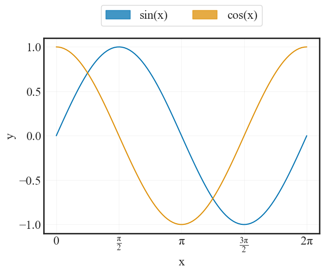
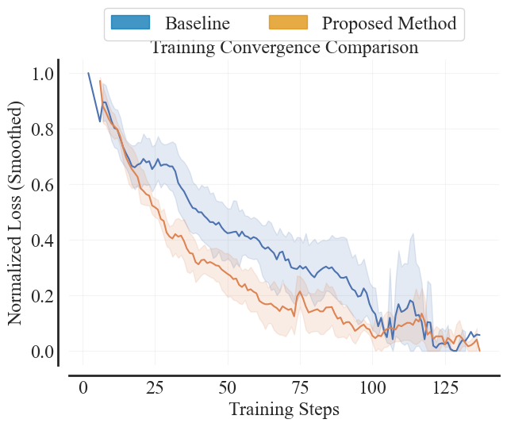
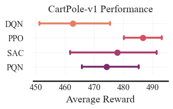

<div align="center">
    
</div>


# Figures and Axes

Figures and Axes (fanda) is a lightweight Python library designed to streamline the process of extracting experiment data from Weights & Biases (wandb) and generating publication-quality plots.The name is a play on "wandb" (Weights and Biases) $\rightarrow$ "fanda" (Figures and Axes).

## Features
- **Seamless Extraction:** Pull scalar histories, configuration configs, and summary metrics from W&B runs easily.
- **Publication Ready:** Generate clean, professional figures using matplotlib and seaborn defaults tailored for academic papers.
- **Conference Styles:** Built-in stylesheets for major conferences (NeurIPS, ICML, ICLR), slides, and posters to automatically handle fonts, sizes, and DPI.
- **Transformations:** Easily transform your data to accelerate your analysis.

## Installation
You can install fanda directly from PyPi:
```bash
pip install fanda
```

## Configuration
Ensure you are logged into W&B before using the library:
```bash
wandb login
```

## Usage
Here is a simple example of how to pull data from a project and plot the training loss.
```python
import matplotlib.pyplot as plt

import fanda
from fanda.wandb_client import fetch_wandb
from fanda import transforms
from fanda.visualizations import lineplot, add_legend, annotate_axis, decorate_axis
from fanda.utils import save_fig, close_fig

plt.style.use('neurips')

df = (
    fetch_wandb("entity", "project", filters={
        "state": "finished",
        "created_at": {"$gte": "2025-01-01"},
    })
    .pipe(transforms.exponential_moving_average, column="loss", alpha=0.7)
    .pipe(transforms.remove_outliers, column="loss")
)
fanda = (
    lineplot(
        df=df,
        x="_step", 
        y="loss", 
        hue="network",
    )
    .pipe(
        annotate_axis, 
        xlabel="Number of Steps",
        ylabel="Loss",
    )
    .pipe(decorate_axis)
    .pipe(add_legend, column="algorithm")
    .pipe(save_fig, name="algorithm_comparison")
    .pipe(close_fig)
)
```

<p align="center">
  
</p>

## License
This project is licensed under the MIT License - see the LICENSE file for details.

## Citation
If you find this tool useful for your research, please consider citing it:
```
@software{fanda2025github,
  author = {Noah Farr},
  title = {fanda: Figures and Axes for Weights and Biases},
  year = {2025},
  url = {https://github.com/noahfarr/fanda},
}
```


